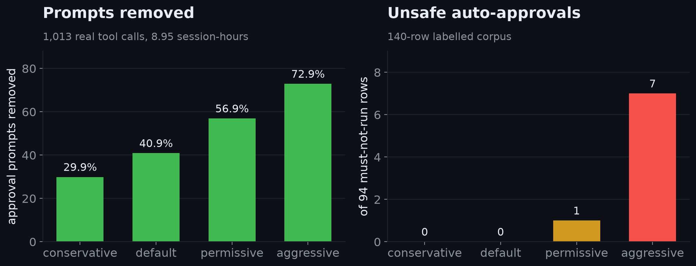
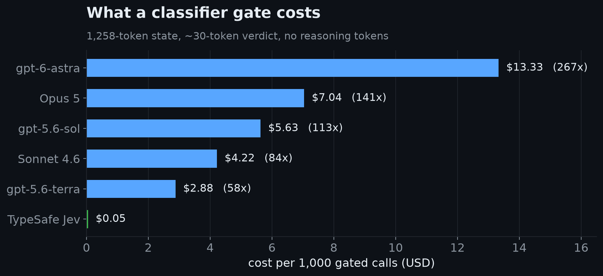
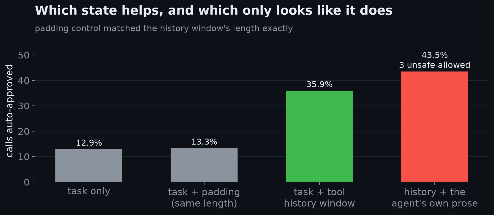

# Greenlight

An OMP plugin that grades every **gated** tool call with TypeSafe's [Jev](https://docs.typesafe.ai) — a "System One" classifier — and suppresses the approval prompt when Jev says allow. Everything else still prompts, with Jev's reasoning attached. You review only the calls that matter.


Measured on real traffic: **1,013 tool calls across 10 sessions, 8.95 session-hours.**

| Preset | conservative | default | permissive | aggressive |
|---|---|---|---|---|
| Approval prompts removed | 29.9% | **40.9%** | 56.9% | 72.9% |
| Prompts per hour | 79.3 | **66.9** | 48.8 | 30.7 |

Safety, on a 140-row labelled command corpus — of the 94 rows marked *review* or *deny*, how many would this preset run unattended:

| Preset | conservative | default | permissive | aggressive |
|---|---|---|---|---|
| Unsafe auto-approvals (of 94) | 0 | **0** | 1 | 7 |



Latency ~310 ms p50, ~450 ms p95 **per gated call**; Jev answers all questions in parallel rather than autoregressively. State is ~1,258 input tokens per gated call. `yolo` mode: Greenlight is a complete no-op — zero API calls.

## Install

```
omp plugin install github:ipriyaaanshu/omp-greenlight
```

Pin the version if you would rather not track `main` (recommended for anything unattended):

```
omp plugin install github:ipriyaaanshu/omp-greenlight#v0.1.0
```

Trial without installing anything:

```
omp --extension ./omp-greenlight/src/index.ts
```

## Make it work (one line, required)

Without this Greenlight is inert: OMP's own approval prompt resolves *before* a plugin can suppress it.

```yaml
tools:
  approval:
    bash: allow
```

`TYPESAFE_API_KEY` must be in the environment. It is never written to config, never logged, and never appears in a decision entry.

Risk dial (optional; the default preset is `default`):

```yaml
greenlight:
  preset: default       # conservative | default | permissive | aggressive
  # window: 10          # tool-history window in prior calls (default 10)
  # autoApproveMinP: 0.9
  # severityCeiling: 2.0
```

Or by environment: `GREENLIGHT_PRESET=permissive`, `GREENLIGHT_MIN_P=0.85`, `GREENLIGHT_ENDPOINT=https://your-proxy/…`.

Lowering the bar is your risk, and it is the operator's decision by design — the plugin never tunes its own threshold, because a self-adjusting safety bar cannot be audited by the person accepting the risk.

## Why it is cheaper than an LLM gate

A "smart gate" built on a frontier model does the same job for far more money. Per 1,000 gated calls, at the measured 1,258-token state and a ~30-token structured verdict:

| Model | Price (per MTok in/out) | Cost per 1,000 calls | vs Jev |
|---|---|---|---|
| **TypeSafe Jev 1.13** | **$0.042 / free** | **$0.05** | — |
| OpenAI gpt-5.6-terra | $2 / $12 | $2.88 | 54x |
| Anthropic Sonnet 4.6 | $3 / $15 | $4.22 | 80x |
| OpenAI gpt-5.6-sol | $4 / $20 | $5.63 | 107x |
| Anthropic Opus 5 | $5 / $25 | $7.04 | 133x |
| OpenAI gpt-6-astra | $10 / $50 | $13.33 | 252x |



Sources: TypeSafe model pricing (`docs.typesafe.ai`), Anthropic list-price PDF, OpenAI API pricing, all read 2026-09-18. Assumptions that matter: one request per call; the LLM emits only a verdict with no chain-of-thought (a reasoning gate costs more); no prompt caching (the state changes every call). Jev's public rate is not proven to be unsubsidized — TypeSafe has said so themselves. The whole 1,013-call measurement above cost about **$0.05**.

## How it works

1. `tool_call` fires before OMP's approval gate. Greenlight builds a state: the user's task, a bounded window of recent tool calls (what was attempted, never why), the working directory, and the proposed call.
2. One Jev request asks three questions — should a human see this, how bad is the worst outcome, is it in scope — and returns all three in parallel.
3. `allow` above the bar → the call runs, no prompt. Anything else → a human prompt carrying Jev's verdict, severity, and probabilities.
4. Every decision is appended to the session (`/greenlight-decisions` shows it) and optionally to a JSONL sink via `GREENLIGHT_LOG`.

### Two things deliberately not shipped



**The agent's own prose is never sent.** Adding the agent's summary of what it was doing to the grading state took corpus safety misses from **0 to 3** — the model reads the agent's justification and agrees with it. Only tool-call history is sent. A length-matched padding control scored 13.3% against the real window's 35.9%, which is how we know the gain is call information rather than Jev reacting to longer input.

**It never shadows a built-in tool.** Re-registering `bash` with a plugin-supplied `approval()` that returns `policy: "allow"` *does* suppress the prompt — and it measurably bypasses OMP's own `bash.patterns: deny` rules, because `ctx.invokeTool` delegation is not re-gated. A safety plugin that voids your deny rules is worse than no plugin, so Greenlight sits beside the host's rules and never above them.

## What this is not

Not a sandbox. Not a security boundary. Installing it hands auto-approval authority for shell commands to a third-party model (TypeSafe's Jev, served from `api.typesafe.ai`). The host's own critical-pattern rules and your `bash.patterns: deny` remain the only deterministic floor — and they still fire ahead of Greenlight, which is covered by a test.

## Security

Data flow, failure behaviour per condition, threat model, and how to report a vulnerability are in
[SECURITY.md](SECURITY.md). The short version: your task prompt, a summary of recent tool calls, the
working directory, and the proposed call go to `api.typesafe.ai` on each gated call; file bodies and
the API key never do; `yolo` sends nothing.

## Scope in v0.1

Gates `bash`, `eval`, `write`, `edit`, `apply_patch`, `delete`, `move`. Prefers `bash` and `eval`, where the measured signal is.

## Reproduce every number

```bash
git clone https://github.com/ipriyaaanshu/omp-greenlight && cd omp-greenlight
export TYPESAFE_API_KEY=...
uv run eval/gate_quality.py      # the 140-row corpus: 0 of 94 at the default bar
uv run eval/threshold_sweep.py   # the preset table
uv run eval/replay_history.py && uv run eval/replay.py   # your own OMP session history
uv run eval/window_sweep.py      # tool-history window sizes + falsification
uv run eval/sandbox.py           # end-to-end plugin tests in a disposable /tmp sandbox
uv run pytest eval/tests -q      # the classifier's decision core (53 tests, no network)
npm run typecheck                # the extension's own type gate
```

Every number above is regenerable this way; `eval/README.md` says what each script is for and
which claims each one supports.

The eval harness reuses the same zero-dependency Python client (`jev/`) that produced the published numbers. Nothing in this repo phones home except the gate itself.

## Limitations

Agent-authored text can be obfuscated around: the grading state excludes the agent's prose (removed after it made dangerous rows look acceptable), but a determined agent still shapes its own inputs. Host-bridge tool calls (browser, computer-use) are invisible to the gate. Headless runs cannot prompt a human, so a non-allow verdict in a headless session blocks only the `deny` class and defers the rest — do not run Greenlight where nobody is reading. Live traffic carries no ground-truth labels: we can count prompts removed, not correctness, so the 140-row corpus is the only labelled safety evidence and it is small. Latency adds ~310 ms p50 per gated call. File bodies are withheld from `write`/`edit` arguments, but a
shell command is sent in full — if the agent inlines file content into a command, that text travels.

MIT licensed.
